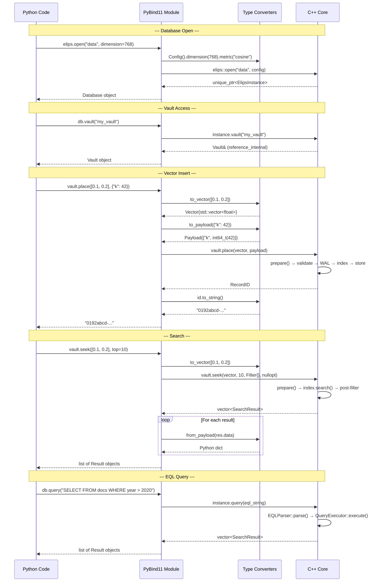

# ELIPS Python Binding Flow

This document describes how the Python SDK maps to the C++ core library via PyBind11, covering type conversions, return value policies, lifetime management, and the call dispatch sequence.

## Binding Architecture Overview

```
+--------------------------------------------------------+
|  Python Application                                     |
|  import elips                                          |
|  db = elips.open("path/to/db")                        |
|  vault = db.vault("my_vault")                         |
|  id = vault.place([0.1, 0.2, ...], {"tag": "foo"})   |
|  results = vault.seek([0.1, 0.2, ...], top=10)       |
+--------------------------------------------------------+
        │ PyBind11 dispatch
        ▼
+--------------------------------------------------------+
|  bindings/python/elips_python.cpp (PyBind11 module)    |
|  Module name: _core (compiled as _core.cpython-*.so)  |
|  Output: bindings/python/elips/_core.so               |
+--------------------------------------------------------+
        │ C++ function calls
        ▼
+--------------------------------------------------------+
|  libelips_core.a (C++ Core Library)                    |
|  elips::open(), ElipsInstance, Vault, Transaction      |
+--------------------------------------------------------+
```

The binding module is compiled as `_core` and placed in `bindings/python/elips/` so that the Python package `elips` can do `from elips._core import ...`.

## Type Conversion: Python → C++

### Python list → Vector

```cpp
elips::Vector to_vector(const py::iterable& values) {
    std::vector<float> out;
    for (const auto& v : values) {
        out.push_back(v.cast<float>());
    }
    return elips::Vector{std::move(out)};
}
```

- Accepts any Python iterable (list, tuple, numpy array via buffer protocol fallback).
- Each element is cast to `float` via `py::cast<float>()`.
- Returns a `Vector` with moved `std::vector<float>`.

### Python dict → Payload

```cpp
elips::MetaValue to_meta(const py::handle& value) {
    if (py::isinstance<py::bool_>(value)) return value.cast<bool>();
    if (py::isinstance<py::int_>(value))   return value.cast<std::int64_t>();
    if (py::isinstance<py::float_>(value)) return value.cast<double>();
    if (py::isinstance<py::str>(value))    return value.cast<std::string>();
    throw py::type_error("metadata values must be int, float, bool, or str");
}

elips::Payload to_payload(const py::dict& data) {
    elips::Payload payload;
    for (const auto& [key, value] : data) {
        payload.emplace(key.cast<std::string>(), to_meta(value));
    }
    return payload;
}
```

- Check order: `bool` before `int` (Python `bool` is a subclass of `int`).
- Supported types: `bool` → `std::int64_t`, `int` → `std::int64_t`, `float` → `double`, `str` → `std::string`.
- Uses `py::isinstance<T>()` + `py::cast<T>()` for type-safe dispatch.

### Python str/none → optional<RecordID>

```cpp
std::optional<elips::RecordID> to_optional_id(const py::object& id) {
    if (id.is_none()) return std::nullopt;
    return elips::RecordID::from_string(id.cast<std::string>());
}
```

- `None` → `std::nullopt` (triggers `RecordID::generate()`).
- String → `RecordID::from_string()` (parses UUID dash-separated hex format).

## Type Conversion: C++ → Python

### Payload → Python dict

```cpp
py::object from_meta(const elips::MetaValue& value) {
    return std::visit([](const auto& v) -> py::object { return py::cast(v); }, value);
}

py::dict from_payload(const elips::Payload& payload) {
    py::dict out;
    for (const auto& [key, value] : payload) {
        out[py::str(key)] = from_meta(value);
    }
    return out;
}
```

- Uses `std::visit` over the `MetaValue` variant to dispatch to the correct `py::cast`.
- Returns a new Python `dict` with string keys.

### Vector → Python tuple

```cpp
py::tuple tuple_from_vector(const elips::Vector& vector) {
    const auto vals = vector.values();
    py::tuple t(vals.size());
    for (std::size_t i = 0; i < vals.size(); ++i) {
        t[i] = py::float_(vals[i]);
    }
    return t;
}
```

## Return Value Policies

### Vault from Database: `reference_internal`

```python
py::class_<elips::Vault, std::unique_ptr<elips::Vault, py::nodelete>>(m, "Vault")
    ...

py::class_<elips::ElipsInstance>(m, "Database")
    .def("vault", &elips::ElipsInstance::vault,
         py::return_value_policy::reference_internal)
```

- **Policy**: `reference_internal` ties the lifetime of the returned `Vault&` reference to the parent `Database` object. The vault will not be garbage collected while the database lives.
- **`py::nodelete`**: The `Vault` class is registered with `std::unique_ptr<elips::Vault, py::nodelete>` — PyBind11 will NOT attempt to delete the object, since it's owned by `ElipsInstance::vaults_`.
- **Result**: `db.vault("name")` returns a reference to a vault owned by the database. No copy, no ownership transfer.

### Config Fluent Builder: `reference_internal`

```python
.def("dimension",
     [](elips::Config& c, std::uint16_t dim) -> elips::Config& {
         return c.dimension(dim);
     },
     py::return_value_policy::reference_internal)
```

- The fluent Config builder methods return `Config&` (self-reference). `reference_internal` ensures Python sees the same object, enabling chaining: `Config().dimension(768).metric("cosine")`.

### Filter Fluent Builder: `reference_internal`

```python
py::class_<elips::Filter>(m, "Filter")
    .def("field", &elips::Filter::field,
         py::return_value_policy::reference_internal)
    .def("equals", [](elips::Filter& f, const py::handle& v) -> elips::Filter& {
             return f.equals(to_meta(v));
         },
         py::return_value_policy::reference_internal)
    ...
```

- Same pattern as Config: enables `Filter().field("year").gte(2023)`.

## Lifetime Management

### TransactionHolder Pattern

```cpp
struct TransactionHolder {
    py::object db_ref;        // Keeps the Database Python object alive
    elips::Transaction txn;   // Holds a raw pointer to ElipsInstance

    TransactionHolder(py::object db, elips::ElipsInstance& instance)
        : db_ref(std::move(db)), txn(instance) {}
};
```

**Problem**: `elips::Transaction` holds a raw `ElipsInstance*` pointer. If the Python `Database` object were garbage collected before the `Transaction`, the pointer would dangle.

**Solution**: `TransactionHolder` stores a `py::object` reference to the Python `Database` object. This increments the Python reference count, preventing garbage collection. The C++ destructor chain ensures `db_ref` outlives `txn`.

```python
# In Python bindings:
.def("begin_transaction",
     [](py::object db_ref) {
         auto& db = db_ref.cast<elips::ElipsInstance&>();
         return std::make_unique<TransactionHolder>(std::move(db_ref), db);
     })
```

### TransactionVault: `py::keep_alive`

```python
py::class_<TransactionHolder>(m, "Transaction")
    .def("vault",
         [](TransactionHolder& h, const std::string& name) {
             return h.txn.vault(name);
         },
         py::keep_alive<0, 1>())
```

- **`py::keep_alive<0, 1>()`**: The return value (index 0, the `TransactionVault`) keeps argument index 1 (the `TransactionHolder`) alive. Prevents the transaction from being destroyed while a vault handle exists.

### Context Manager (__enter__/__exit__)

```python
# Database context manager:
.def("__enter__", [](elips::ElipsInstance& db) { return &db; })
.def("__exit__", [](elips::ElipsInstance& db, ...) { db.close(); })

# Transaction context manager (auto-commit on success, auto-rollback on exception):
.def("__enter__", [](TransactionHolder& h) -> TransactionHolder& { return h; })
.def("__exit__", [](TransactionHolder& h, const py::object& exc_type, ...) -> bool {
         if (exc_type.is_none()) { h.txn.commit(); }
         return false;  // don't suppress exception
     })
```

Usage:
```python
with elips.open("db") as db:
    with db.begin_transaction() as txn:
        v = txn.vault("data")
        v.place([0.1, 0.2], {"tag": "foo"})
    # commits on clean exit, rollback on exception
# checkpoint + close on exit
```

## Error Mapping

```cpp
auto elips_error = py::register_exception<elips::ElipsError>(m, "ElipsError", PyExc_RuntimeError);
py::register_exception<elips::DimensionMismatch>(m, "DimensionMismatch", elips_error);
py::register_exception<elips::InvalidVector>(m, "InvalidVector", elips_error);
py::register_exception<elips::ConfigError>(m, "ConfigError", elips_error);
py::register_exception<elips::NotFound>(m, "NotFound", elips_error);
py::register_exception<elips::StorageError>(m, "StorageError", elips_error);
py::register_exception<elips::LockConflict>(m, "LockConflict", elips_error);
py::register_exception<elips::eql::ParseError>(m, "ParseError", elips_error);
```

All C++ exceptions derive from `elips::ElipsError` → `std::runtime_error`. PyBind11's exception translator maps them to a Python exception hierarchy rooted at `ElipsError` (base `RuntimeError`). Python code can catch specific exception types:

```python
try:
    vault.place(wrong_dim_vector)
except elips.DimensionMismatch as e:
    print(f"Wrong dimension: {e}")
```

## Call Sequence Diagram



## Build Integration

```cmake
option(ELIPS_BUILD_PYTHON "Build the Python (PyBind11) bindings" OFF)

if(ELIPS_BUILD_PYTHON)
    include(FetchContent)
    FetchContent_Declare(
        pybind11
        URL https://github.com/pybind/pybind11/archive/refs/tags/v2.13.6.zip
    )
    FetchContent_MakeAvailable(pybind11)

    pybind11_add_module(elips_pymodule bindings/python/elips_python.cpp)
    target_link_libraries(elips_pymodule PRIVATE elips_core)
    set_target_properties(elips_pymodule PROPERTIES
        OUTPUT_NAME _core
        LIBRARY_OUTPUT_DIRECTORY ${CMAKE_CURRENT_SOURCE_DIR}/bindings/python/elips
    )
endif()
```

- **Optional**: Controlled by `ELIPS_BUILD_PYTHON`. Off by default.
- **PyBind11 v2.13.6**: Fetched via `FetchContent` from GitHub.
- **Output**: `_core.cpython-3XX-darwin.so` (or platform equivalent) placed in `bindings/python/elips/`.
- **GPU support**: If `ELIPS_GPU_ENABLED`, the binding module gets the `ELIPS_GPU_ENABLED` compile definition, enabling GPU config and device info bindings.