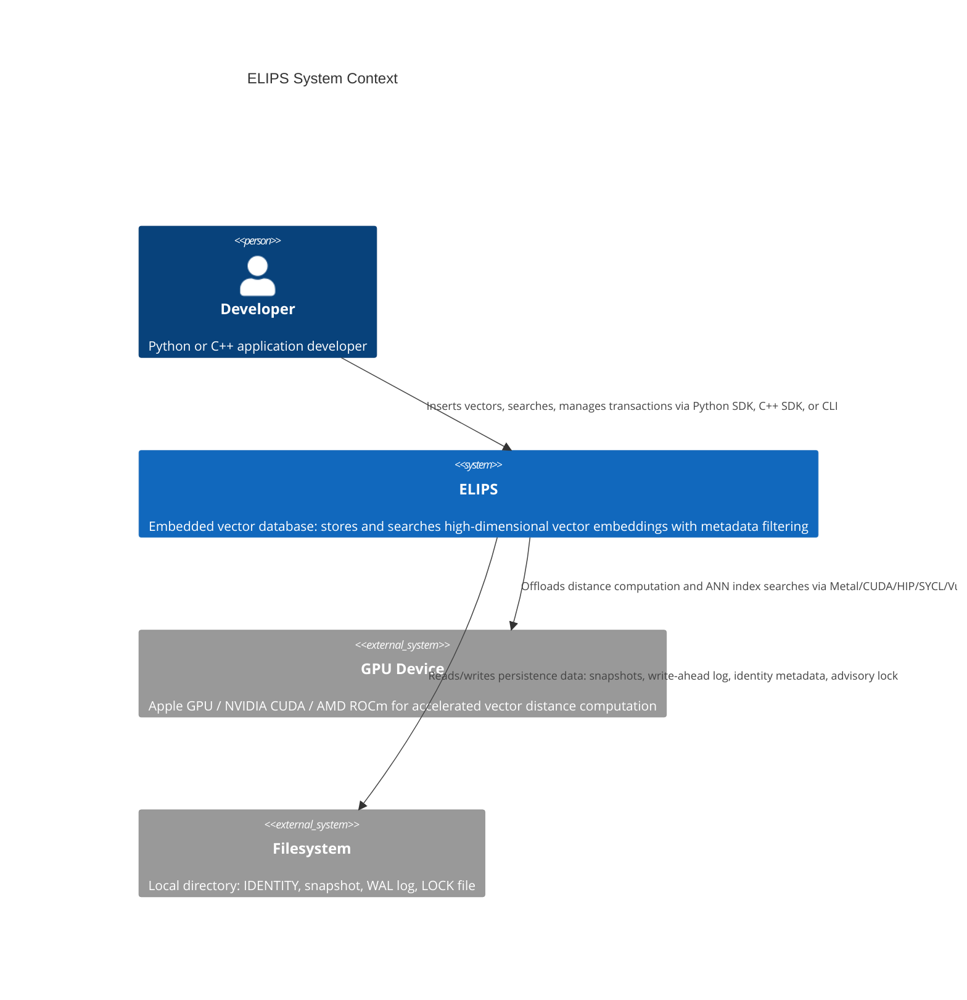
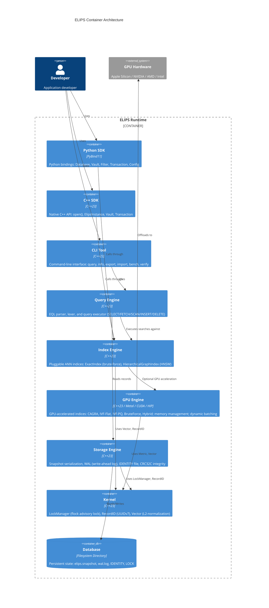

# ELIPS System Architecture

ELIPS is an embedded local vector database implemented in C++23 with Python and C++ SDKs, GPU acceleration, and single-writer/multi-reader concurrency via advisory file locks. This document describes the high-level system architecture.

## C4 Context Diagram



## Container Diagram



## Layered Architecture

ELIPS follows a clean layered architecture with five logical tiers:

```
+-------------------------------------------------------------+
|  API Layer (CLI, Python SDK, C++ SDK)                      |
|  - CLI: command-line tool (elips)                           |
|  - Python: PyBind11 bindings (elips._core)                 |
|  - C++: Direct C++ API (open(), ElipsInstance, Vault)      |
+-------------------------------------------------------------+
|  Query Engine Layer                                         |
|  - EQL Parser + Lexer (recursive descent)                   |
|  - Query Executor (Statement → SearchResult via std::visit) |
|  - AST: SearchStatement, FetchStatement, ScanStatement,    |
|    InsertStatement, DeleteStatement                         |
+-------------------------------------------------------------+
|  Index Engine Layer                                         |
|  - IndexPort (abstract interface, Dependency Inversion)    |
|  - ExactIndex (brute-force, ground truth for benchmarks)   |
|  - HierarchicalGraphIndex (HNSW, primary ANN index)        |
|  - IndexFactory (DIP: creates IndexPort from Config)       |
+-------------------------------------------------------------+
|  Storage Engine Layer                                       |
|  - WAL: write-ahead log (CRC32C-validated, append-only)    |
|  - Snapshot: full serialization, atomic rename             |
|  - IDENTITY file: dimension, metric, index type            |
|  - LockManager: flock(LOCK_EX|LOCK_NB) advisory lock       |
+-------------------------------------------------------------+
|  GPU Engine Layer (optional, compile-time backend)          |
|  - GpuPort (abstract backend interface)                    |
|  - Backends: Metal, CUDA, HIP, SYCL, Vulkan                |
|  - Indices: GpuGraphIndex, GpuBruteForce, GpuIVFFlat,     |
|    GpuIVFPQ, GpuHybridIndex                                |
|  - Memory: GpuMemoryManager (best-fit pool), unified       |
|  - Batching: DynamicBatcher (time-window + max-batch)      |
|  - Profiling: GpuProfiler (kernel timing recording)        |
+-------------------------------------------------------------+
```

### Layer Descriptions

#### 1. API Layer
The outermost layer provides three entry points to the system:
- **C++ SDK**: Direct usage of `elips::open()`, `elips::ElipsInstance`, `elips::Vault`, `elips::Transaction`. The `ElipsInstance` class owns all vaults and the WAL. Headers are in `include/elips/`.
- **Python SDK**: PyBind11 bindings in `bindings/python/elips_python.cpp` expose the C++ classes as `Database`, `Vault`, `Filter`, `Transaction`, `Config`. Uses `TransactionHolder` to keep the Python `Database` reference alive during transaction lifetime.
- **CLI Tool**: A standalone executable (`elips_cli` → `elips`) at `cli/src/main.cpp` supporting commands: `info`, `vaults`, `query`, `checkpoint`, `export`, `import`, `verify`, `stats`, `bench`. Parses JSON for import/export.

#### 2. Query Engine Layer
The EQL (ELIPS Query Language) engine provides a SQL-like query interface:
- **Lexer** (`EQLLexer`): Tokenizes EQL source into `Token` objects (kind: word, number, string, punct, end).
- **Parser** (`EQLParser`): Recursive-descent parser producing an AST as `Statement` variant (SearchStatement, FetchStatement, ScanStatement, InsertStatement, DeleteStatement).
- **Executor** (`QueryExecutor`): Uses `std::visit` over the statement variant, delegating to `ElipsInstance::vault()` operations. Supports vector bindings (`$name`), threshold filtering, rank-by metadata field ordering, and field projection.

#### 3. Index Engine Layer
Implements vector similarity search with pluggable backends:
- **IndexPort**: Pure virtual interface defining `insert()`, `remove()`, `search()`, `size()`, `type_name()`. All callers depend only on this interface (Dependency Inversion Principle).
- **ExactIndex**: Brute-force linear scan over row-major float arrays. Returns exact top-k using `std::partial_sort`. Used for small collections and as the ground-truth oracle for ANN benchmarks.
- **HierarchicalGraphIndex** (HNSW): Primary ANN index. Multi-layer directed graph with probabilistic level assignment (`mL = 1/ln(M)`). Implements beam search (`search_layer`) with candidate min-heap + result max-heap, and diversity-based neighbor selection (`connect`). Removals are soft tombstones (flag deleted; graph structure preserved).
- **IndexFactory**: Factory function `make_index()` that creates the concrete `IndexPort` from `Config` settings.

#### 4. Storage Engine Layer
Provides persistence and crash safety:
- **WAL** (Write-Ahead Log): Located at `wal.log` in the database directory. Every insert/erase is appended (with CRC32C checksum) to the log BEFORE the in-memory mutation. Configured sync behavior via `Durability`: `paranoid` (flush every record), `standard` (flush every record, group-commit deferred), `relaxed` (buffered, flushed on checkpoint/close), `ephemeral` (no WAL).
- **Snapshot**: Full database serialization to `elips.snapshot`. Written to a temp file first, then atomically renamed over the live snapshot (`fs::rename`). After a successful snapshot, the WAL is truncated (`WAL::reset()`).
- **IDENTITY**: Binary file recording the dimension, metric, and index type. Validated on open to prevent configuration conflicts.
- **LockManager**: RAII advisory file lock on the `LOCK` file using POSIX `flock(LOCK_EX | LOCK_NB)`. Enforces the single-writer / multi-reader contract across processes.

#### 5. GPU Engine Layer
Optional layer for GPU-accelerated vector operations (see `docs/internals/gpu-engine.md` for exhaustive details):
- **GpuPort**: Abstract interface with 13 virtual methods for device management, memory allocation, data transfer, distance computation, and synchronization.
- **Five backends**: Metal (Apple, always-on), CUDA (NVIDIA), HIP (AMD), SYCL (Intel), Vulkan (cross-platform).
- **GpuDeviceManager**: Probes all compile-time-enabled backends, sorts by CAGRA support and memory capacity, selects the best available.
- **GpuSelector**: Ranks backends (`cuda=100, hip=90, metal=80, sycl=50, vulkan=30, cpu=0`) and selects per policy.
- **GPU Indices**: GpuGraphIndex (CAGRA), GpuBruteForceIndex, GpuIVFFlatIndex, GpuIVFPQIndex, GpuHybridIndex (GPU + CPU fallback).
- **Memory**: GpuMemoryManager (best-fit pool allocator, thread-safe), GpuMemoryPool (fixed-size pool with block coalescing), pinned memory via `aligned_alloc`, unified memory auto-detection on Apple Silicon.
- **Batching**: DynamicBatcher (push model, worker thread, time-window + max-batch coalescing, `std::future` results).
- **Pipelines**: GpuSearchPipeline (batch search orchestration), GpuQuantizationPipeline (PQ codebook training, encoding), GpuIngestionPipeline (normalization, quantization).
- **Profiling**: GpuProfiler records kernel timing (`KernelTiming`: kernel_name, duration, work_items).

### Cross-Cutting Concerns

- **Error Handling**: All errors derive from `elips::ElipsError` (inherits `std::runtime_error`). Subclasses: `DimensionMismatch`, `InvalidVector`, `ConfigError`, `NotFound`, `StorageError`, `LockConflict`, `ParseError` (EQL).
- **Durability Levels**: `paranoid` (flush WAL every record), `standard` (flush WAL every record, group-commit future), `relaxed` (WAL buffered), `ephemeral` (no WAL, in-memory only).
- **In-Memory Mode**: Pass `":memory:"` as the path to `open()`. No persistence, no WAL, no lock. Requires explicit dimension.
- **Vaults**: Named partitions of records within a database. Each Vault owns its own `IndexPort` and `std::map<RecordID, Record>` record store. Created lazily on first access via `ElipsInstance::vault(name)`.

### Key Design Decisions

| Decision | Rationale |
|----------|-----------|
| C++23 standard | `std::expected`, `std::span`, `std::variant`, concepts support |
| Single-writer model | Advisory file lock + single-threaded WAL simplifies ACID semantics |
| UUIDv7 RecordID | Time-ordered (lexicographic byte order = insertion order), 128-bit |
| Pluggable indices (DIP) | IndexPort interface enables swapping ExactIndex/HNSW/GPU indices without changing callers |
| WAL-before-memory | Mutations are durably recorded before in-memory state changes |
| Atomic snapshot publish | Write to temp file, `fs::rename` over live snapshot (POSIX atomic rename) |
| Best-fit pool allocator | GPU memory pool minimizes fragmentation with block coalescing on free |
| Compile-time backend detection | `#if defined(ELIPS_METAL_ENABLED)` etc. — no runtime dispatch overhead for disabled backends |
| PyBind11 bindings | Direct C++ exposure, zero-copy where possible, RAII lifetime management via `TransactionHolder` |